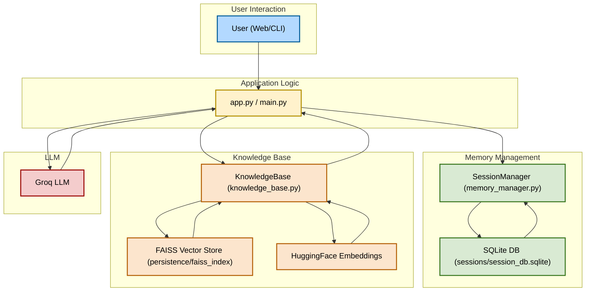

# Agentic Memory Chat

## Description
Agentic Memory Chat is a conversational AI chatbot with persistent memory and a customizable knowledge base. It features a user-friendly interface built with Streamlit, leverages Groq LLM for natural language responses, and allows dynamic updates to its knowledge base.

## Features
- Conversational chatbot interface
- Custom knowledge base upload and update
- Session-based memory management
- Uses Groq LLM for natural language responses
- Persistent vector store (FAISS)
- SQLite-based session storage

## Demo

### Option 1: Embedded Video (Recommended)
If you have a `demo.mp4` file in this repository, you can watch it directly here:


### Option 2: YouTube Video
<iframe width="560" height="315" src="https://www.youtube.com/embed/Rr6vuQPuTdI" frameborder="0" allowfullscreen></iframe>


**Note:** To add your own demo video, simply place a `demo.mp4` file in the root directory of this repository. The video will automatically be embedded above.

## Installation
1. **Clone the repository:**
   ```sh
   git clone https://github.com/Shivadzn/Agent_memory_managements.git
   ```
2. **Create and activate a Python virtual environment:**
   ```sh
   python -m venv venv
   # On Windows:
   venv\Scripts\activate
   # On macOS/Linux:
   source venv/bin/activate
   ```3. **Install dependencies:**
   ```sh
   pip install -r requirements.txt
   ```
4. **Set up environment variables:**
   - Create a `.env` file in the project root with your Groq API key:
     ```env
     GROQ_API_KEY=your_api_key_here
     ```
5. **Run the app:**
   ```sh
   streamlit run app.py
   ```

## Usage
- Enter a session ID to start or continue a chat session.
- Ask questions in the chat input box.
- To add new information, use the "Upload New Knowledge" section, enter your text, and click "Update Knowledge Base". The chat history will be cleared so your next question uses the new knowledge.
- The conversation history is displayed below the chat input.

## Updating the Knowledge Base
- Enter new information in the provided text area and click the update button.
- After updating, the chat history is cleared to ensure new queries use the latest knowledge.

## Architecture
The following flowchart illustrates the architecture and data flow of the Agentic Memory Chat project:



## Requirements
- Python 3.8+
- Streamlit
- langchain
- langchain_groq
- dotenv

## License
This project is licensed under the terms of the LICENSE file in this repository. 
