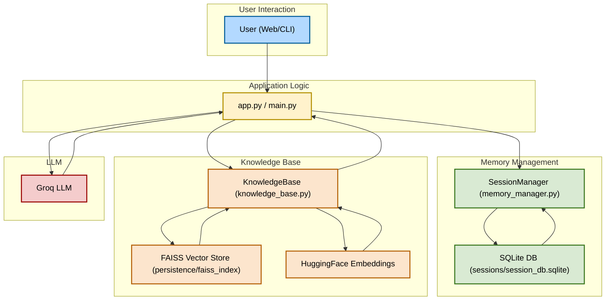

Agentic Memory Chat
===================

This project is a conversational AI chatbot with memory and a customizable knowledge base. It uses Streamlit for the interface, Groq LLM for responses, and allows users to update the knowledge base on the fly.

Features
--------
- Conversational chatbot interface
- Custom knowledge base upload and update
- Session-based memory management
- Uses Groq LLM for natural language responses

Setup Instructions
------------------
1. Clone the repository to your local machine.
2. Create and activate a Python virtual environment (venv).
3. Install dependencies:
   Code:
   pip install -r requirements.txt
4. Add your GROQ_API_KEY to a .env file in the project root:
   Code:
   GROQ_API_KEY=your_api_key_here
5. Run the app:
   Code:
   streamlit run app.py

Usage
-----
- Enter a session ID to start or continue a chat session.
- Ask questions in the chat input box.
- To add new information, use the "Upload New Knowledge" section, enter your text, and click "Update Knowledge Base". The chat history will be cleared so your next question uses the new knowledge.
- The conversation history is displayed below the chat input.

Updating the Knowledge Base
--------------------------
- Enter new information in the provided text area and click the update button.
- After updating, the chat history is cleared to ensure new queries use the latest knowledge.

Requirements
------------
- Python 3.8+
- Streamlit
- langchain
- langchain_groq
- dotenv

For more details, see the code and comments in app.py. 

Architecture Diagram
--------------------

The following flowchart illustrates the architecture and data flow of the Agentic Memory Chat project, with color-coded components and black text for clarity:

